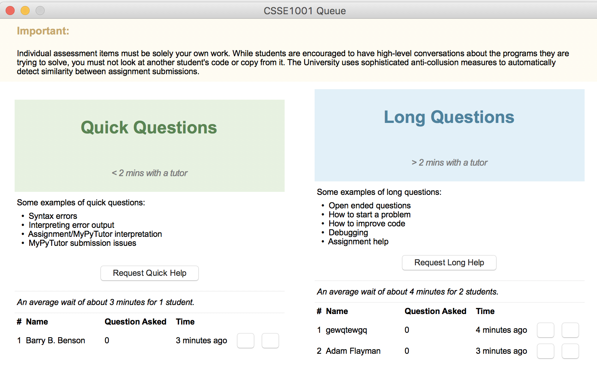

# CSSE1001_Queuing_System First Year Project
* Local queuing system using TCP Network Protocol
* Resembles both interface and functionality of the online waiting queue (website) of the course CSSE1001 in UQ using **Tkinter**.

## Interface

Format: 

